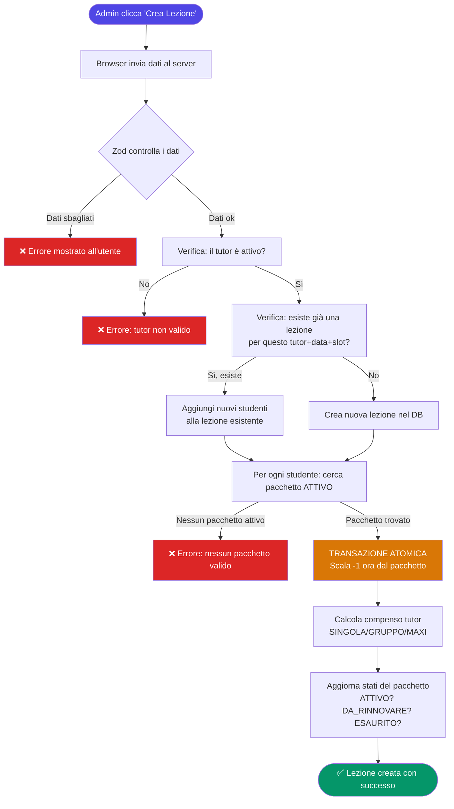
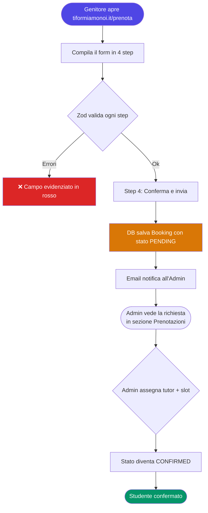
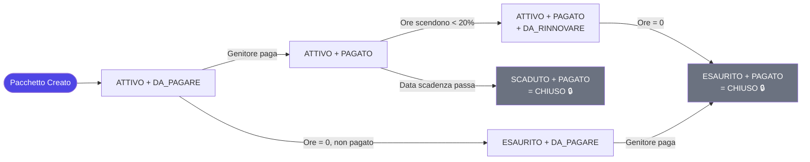

# DOCUMENTAZIONE_PROGETTO.md
## La "Bibbia" della Riscrittura — tiformiamonoi.it Gestionale

> **Nota per chi legge:** Questo documento è scritto per te, anche se non sei un programmatore.
> Ogni concetto tecnico è spiegato con una metafora semplice, seguita da "Cosa significa in pratica per te".

---

## Indice

1. [Il Progetto in Breve](#1-il-progetto-in-breve)
2. [La Nuova Casa: Struttura Nuxt 4](#2-la-nuova-casa-struttura-nuxt-4)
3. [La Dogana: Validazione con Zod](#3-la-dogana-validazione-con-zod)
4. [Il Cervello: Macchina a Stati dei Pacchetti](#4-il-cervello-macchina-a-stati-dei-pacchetti)
5. [Mappa Visuale — Flusso Completo](#5-mappa-visuale--flusso-completo)
6. [Design System & UI — Look & Feel](#6-design-system--ui--look--feel)
7. [Manuale di Collaudo — Nessun Codice](#7-manuale-di-collaudo--nessun-codice)
8. [Appendice Tecnica — Riepilogo Entità](#8-appendice-tecnica--riepilogo-entità)

---

## 1. Il Progetto in Breve

### Cos'è questa applicazione?

**tiformiamonoi.it** è il gestionale interno del doposcuola. Permette di:

- **Gestire gli studenti** (anagrafica, scuola, contatti genitore per fatturazione)
- **Gestire i pacchetti ore** che ogni studente acquista (es. "10 ore fisse", "Mensile", o "A Consumo ricaricabile")
- **Registrare le lezioni** svolte dai tutor, scalando automaticamente le ore dal pacchetto dello studente
- **Tracciare i pagamenti** (acconti, saldi, rate) e sapere chi non ha ancora pagato
- **Pagare i tutor** calcolando i loro compensi in base alle lezioni effettuate
- **Gestire le prenotazioni** di nuovi studenti (pagina pubblica accessibile senza login)
- **Consultare la contabilità** con entrate, uscite e margini giornalieri/mensili

### Chi usa l'app?

| Ruolo | Cosa può fare |
|-------|---------------|
| **Admin** | Tutto: studenti, lezioni, pagamenti, tutor, impostazioni |
| **Tutor** | Visualizzare le proprie lezioni e la propria disponibilità |
| **Genitore** | (Futuro) accesso limitato per vedere lo stato del figlio |

### Le 7 "schermate" principali scoperte nell'analisi

Dall'analisi del codice originale emergono queste sezioni:

1. **Alunni** — elenco studenti con stato pacchetto, ore residue, pagamenti
2. **Prenotazioni** — richieste di nuovi studenti dal sito pubblico
3. **Tutor** — anagrafica tutor, compensi, rimborsi spese
4. **Contabilità** — registro entrate/uscite, margini
5. **Impostazioni** — pacchetti standard, slot orari, chiusure, config globale
6. **Dashboard** — panoramica rapida del centro
7. **Pagina Pubblica Prenotazioni** — form per nuovi studenti (senza login)

---

## 2. La Nuova Casa: Struttura Nuxt 4

### La Metafora del Ristorante

Immagina un ristorante ben organizzato:

| Parte del ristorante | Corrisponde a | Ruolo |
|---------------------|---------------|-------|
| **Sala e camerieri** | `server/api/` | Ricevono le richieste dei clienti (il browser) e portano le risposte |
| **La cucina e i cuochi** | `server/services/` | Applicano le regole di business, fanno i calcoli |
| **La dispensa** | `server/database/` | Comunicano con il database (dove sono salvati tutti i dati) |
| **Il menu** | `shared/schemas/` | Definisce cosa può essere ordinato (validazione Zod) |
| **La sala da pranzo** | `app/pages/` | Le schermate che vede l'utente nel browser |

> **Cosa significa in pratica per te:** Questa separazione fa sì che, se un giorno vuoi cambiare il database, cambi solo la "dispensa" senza toccare la "cucina". Se vuoi cambiare l'aspetto grafico, tocchi solo la "sala".

### Struttura cartelle proposta (Nuxt 4)

```
tiformiamonoi_gestionale/
│
├── app/                          ← FRONTEND (quello che vede l'utente)
│   ├── pages/
│   │   ├── index.vue             → Dashboard principale
│   │   ├── alunni/
│   │   │   ├── index.vue         → Elenco studenti
│   │   │   └── [id].vue          → Dettaglio singolo studente
│   │   ├── prenotazioni/
│   │   │   └── index.vue         → Gestione richieste nuovi studenti
│   │   ├── tutor/
│   │   │   └── index.vue         → Gestione tutor
│   │   ├── contabilita/
│   │   │   └── index.vue         → Registro contabile
│   │   ├── impostazioni/
│   │   │   └── index.vue         → Config globale
│   │   └── prenota.vue           → Pagina PUBBLICA (senza login)
│   │
│   ├── components/               ← Pezzi di schermata riutilizzabili
│   │   ├── student/
│   │   ├── package/
│   │   ├── lesson/
│   │   └── ui/                   → Bottoni, badge, card, ecc.
│   │
│   └── layouts/
│       ├── default.vue           → Layout con sidebar (per utenti loggati)
│       └── public.vue            → Layout senza sidebar (pagina prenota)
│
├── server/                       ← BACKEND (la logica nascosta)
│   ├── api/                      ← I "camerieri" — ricevono richieste HTTP
│   │   ├── students/
│   │   │   ├── index.get.ts      → GET  /api/students     (lista)
│   │   │   ├── index.post.ts     → POST /api/students     (crea)
│   │   │   └── [id].put.ts       → PUT  /api/students/:id (modifica)
│   │   ├── packages/
│   │   ├── lessons/
│   │   ├── payments/
│   │   └── auth/
│   │
│   ├── services/                 ← I "cuochi" — la logica di business
│   │   ├── package.service.ts    → Calcola stati pacchetto, scala ore
│   │   ├── lesson.service.ts     → Crea lezioni, aggiorna compensi tutor
│   │   ├── payment.service.ts    → Registra pagamenti, aggiorna residui
│   │   └── accounting.service.ts → Genera movimenti contabili
│   │
│   └── database/                 ← La "dispensa" — parla col DB
│       ├── schema.ts             → Struttura completa del DB (Drizzle ORM)
│       └── client.ts             → Connessione Drizzle/PostgreSQL
│
├── shared/
│   └── schemas/                  ← I "menu" — regole di validazione Zod
│       ├── student.schema.ts
│       ├── package.schema.ts
│       └── lesson.schema.ts
│
└── nuxt.config.ts                ← Configurazione globale Nuxt
```

### Comando CLI per inizializzare il progetto

```powershell
# PASSO 1: Crea il progetto Nuxt 4
npx nuxi@latest init tiformiamonoi_gestionale

# PASSO 2: Entra nella cartella
cd tiformiamonoi_gestionale

# PASSO 3: Installa le dipendenze base
npm install

# PASSO 4: Avvia il server di sviluppo (per vedere l'app nel browser)
npm run dev
```

> **Cosa significa in pratica per te:** Dopo questi 4 comandi, apri il browser su `http://localhost:3000` e vedi l'app funzionante in tempo reale. Ogni modifica che facciamo si riflette istantaneamente.

---

## 3. La Dogana: Validazione con Zod

### La Metafora della Dogana

Immagina un aeroporto con la dogana. **Zod è la dogana** del tuo sistema:

- Ogni dato che entra dall'esterno (dal form del browser) deve **passare il controllo**
- Se il dato è "sospetto" (un'email senza la @, un numero negativo, un campo vuoto obbligatorio), viene **bloccato prima di arrivare al database**
- Il database rimane **sempre pulito e corretto**

> **Cosa significa in pratica per te:** Nessun utente potrà mai salvare "ore acquistate = -5" o un'email malformata. Il sistema li blocca automaticamente con un messaggio chiaro, prima ancora che il dato tocchi il database.

### Bug risolto grazie a Zod (trovato nell'analisi)

Nel vecchio sistema, la validazione era fatta "a mano" con `express-validator`, separata dalla definizione dei dati. Questo ha causato **inconsistenze**: alcuni campi non venivano validati su certi endpoint. Con Zod, **lo schema è unico e condiviso** tra frontend e backend.

### Esempi degli schemi chiave

**Schema Pacchetto (il contratto su cosa è un pacchetto valido):**

```typescript
// shared/schemas/package.schema.ts
import { z } from 'zod'

export const PackageSchema = z.object({
  studentId: z.string().cuid(),
  nome: z.string().min(1, 'Il nome è obbligatorio'),
  tipo: z.enum(['ORE', 'MENSILE']),
  oreAcquistate: z.number().positive('Le ore devono essere > 0'),
  prezzoTotale: z.number().nonnegative('Il prezzo non può essere negativo'),
  dataInizio: z.coerce.date(),
  // Campi opzionali per pacchetti mensili
  giorniAcquistati: z.number().int().positive().optional(),
  orarioGiornaliero: z.number().positive().optional(),
})
```

**Schema Lezione (con controllo incrociato studenti):**

```typescript
// shared/schemas/lesson.schema.ts
export const LessonSchema = z.object({
  tutorId: z.string().cuid(),
  timeSlotId: z.string().cuid(),
  data: z.coerce.date(),
  studenti: z.array(z.object({
    studentId: z.string().cuid(),
    mezzaLezione: z.boolean().default(false),
  })).min(1, 'Serve almeno uno studente'),
  note: z.string().optional(),
})
```

### Comando CLI per installare Zod

```powershell
# Installa Zod
npm install zod

# (Nessuna altra dipendenza necessaria — Zod funziona sia lato server che lato browser)
```

> **Cosa significa in pratica per te:** Quando compili un form e dimentichi un campo obbligatorio, il sistema ti mostra il messaggio d'errore **prima** di inviare la richiesta al server. Più veloce e più sicuro.

---

## 4. Il Cervello: Macchina a Stati dei Pacchetti

### La Metafora del Semaforo

Un pacchetto ore è come un **semaforo intelligente** che cambia colore in base alla situazione:

- 🟢 **ATTIVO** → Tutto ok, puoi fare lezioni
- 🟡 **DA_RINNOVARE** → Attenzione, le ore stanno finendo (< 20% rimaste)
- 🔴 **SCADUTO** → La data di scadenza è passata
- ⚫ **ESAURITO** → Le ore sono finite (= 0)
- 💳 **DA_PAGARE** → Il genitore deve ancora saldare
- ✅ **PAGATO** → Tutto saldato
- 🔒 **CHIUSO** → Pacchetto concluso (Pagato + Scaduto/Esaurito)

### I tre tipi di pacchetti

Il sistema supporta tre logiche distinte:
1. **ORE:** Si comprano un tot di ore fisse (es. 10 ore). Le ore scalano man mano che si fanno lezioni. Quando arrivano a 0, il pacchetto è esaurito.
2. **MENSILE:** Valido per un certo numero di giorni (es. 30 giorni) e garantisce un tetto di ore. Il sistema scala "1 giorno" solo alla prima lezione di quella data.
3. **A CONSUMO:** È un libretto prepagato e ricaricabile. Si imposta una *tariffa oraria* (es. 25€/ora) e non ha ore prefissate all'inizio. Il genitore fa una **ricarica** (es. 100€) e il sistema converte automaticamente l'importo in ore (es. 4 ore) sommandole a quelle esistenti. Questo pacchetto ha un "Libretto Ricariche" per visualizzare lo storico dei pagamenti.

> **Cosa significa in pratica per te:** Un pacchetto può avere **più stati contemporaneamente**. Ad esempio: `[ATTIVO, DA_RINNOVARE, DA_PAGARE]` significa "funziona ancora, ma ha poche ore rimaste e non è stato pagato". Il sistema ti mostra badge colorati per ogni situazione.

### Le regole esatte della macchina a stati

Queste regole sono state **estratte dal codice originale** (`packageStates.js`) e cristallizzate qui come legge definitiva:

```
REGOLA 1 — ESAURITO:
  Se oreResiduo = 0  →  aggiungi ESAURITO

REGOLA 2 — SCADUTO:
  Se dataScadenza < oggi  →  aggiungi SCADUTO

REGOLA 3 — ATTIVO:
  Se oreResiduo > 0  E  dataScadenza >= oggi  →  aggiungi ATTIVO

REGOLA 4 — DA_RINNOVARE (solo se già ATTIVO):
  Se percentualeResiduo < 20%
  OPPURE giorni alla scadenza <= 3
  →  aggiungi DA_RINNOVARE

REGOLA 5 — PAGAMENTO (sempre uno dei due, mai entrambi):
  Se importoResiduo > 0  →  aggiungi DA_PAGARE
  Se importoResiduo = 0  →  aggiungi PAGATO

REGOLA 6 — CHIUSO (stato finale):
  Se PAGATO E (SCADUTO OPPURE ESAURITO)  →  aggiungi CHIUSO

REGOLA DISPLAY:
  Se CHIUSO è presente  →  mostra SOLO "Chiuso" (nasconde gli altri)
```

### Il bug di concorrenza trovato (e la soluzione)

**Problema nel vecchio sistema:** Quando due lezioni venivano create quasi simultaneamente per lo stesso studente, poteva succedere questo:

```
Richiesta A legge: oreResiduo = 3
Richiesta B legge: oreResiduo = 3  ← legge lo stesso valore!
Richiesta A scrive: oreResiduo = 2  (-1 ora)
Richiesta B scrive: oreResiduo = 2  (-1 ora, ma avrebbe dovuto essere 1!)
```

Risultato: due ore scalate, ma il database mostra solo -1 invece di -2.

**Soluzione nella nuova architettura:** Ogni operazione che tocca le ore di un pacchetto usa una **transazione atomica del database**. In parole semplici: il database "blocca" il record mentre lo modifica, nessun altro può leggere i valori vecchi nel frattempo.

```
Metafora: è come usare un lucchetto sul cassetto della dispensa.
Chi vuole prendere qualcosa deve aspettare che il lucchetto sia aperto.
```

### Calcolo dei compensi tutor (tariffe dal codice)

Trovate nel file `lessonCalculations.js`:

| Tipo Lezione | Studenti | Tariffa Ora | Tariffa Mezza Ora |
|--------------|----------|-------------|-------------------|
| **SINGOLA** | 1 | € 5,00 | € 2,50 |
| **GRUPPO** | 2–4 | € 8,00 | € 4,00 |
| **MAXI** | 5+ | € 8,50 | € 4,00 |

> **Nota:** Esiste una modalità `forzaGruppo` che permette di pagare un tutor con tariffa GRUPPO anche con 1 solo studente (usato in casi speciali).

### Calcolo ore perse alla scadenza

Quando un pacchetto scade con ore rimaste, queste diventano "ore perse":

- **Pacchetto ORE:** ore perse = ore residue al momento della scadenza
- **Pacchetto MENSILE:** ore perse = (giorni_totali × ore_giornaliere) − ore_effettivamente_usate

---

## 5. Mappa Visuale — Flusso Completo

### Flusso 1: Creazione di una Lezione



### Flusso 2: Prenotazione da Sito Pubblico



### Flusso 3: Stato di un Pacchetto nel Tempo



---

## 6. Design System & UI — Look & Feel

### Palette Colori

| Nome | Codice Esadecimale | Uso |
|------|--------------------|-----|
| **Primary** | `#4F46E5` (indigo) | Bottoni principali, link, accenti |
| **Success** | `#059669` (verde smeraldo) | Badge ATTIVO, PAGATO, conferme |
| **Warning** | `#D97706` (ambra) | Badge DA_RINNOVARE, avvisi |
| **Danger / Error** | `#DC2626` (rosso) | Badge SCADUTO, errori, eliminazione |
| **Neutral** | `#6B7280` (grigio) | Badge CHIUSO, elementi inattivi |
| **Background** | `#F9FAFB` | Sfondo pagina |
| **Surface** | `#FFFFFF` | Sfondo card, modal, tabelle |
| **Text Primary** | `#111827` | Testo principale |
| **Text Secondary** | `#6B7280` | Testo secondario, date, sottotitoli |

### Font Family

- **Font principale:** `Inter` (sans-serif, importato da Google Fonts)
- **Font codice/numeri:** `JetBrains Mono` (per importi €, ore, date precise)

```
Titoli (h1, h2):    Inter Bold (700)     — 24px / 20px
Testo normale:      Inter Regular (400)  — 16px / 14px
Etichette form:     Inter Medium (500)   — 14px
Importi €:          JetBrains Mono (400) — 14px
```

### Regole per i Bottoni

| Tipo bottone | Colore | Quando usarlo |
|-------------|--------|---------------|
| **Primary** | Indigo pieno `#4F46E5` | Azione principale della schermata ("Salva", "Crea", "Conferma") |
| **Secondary / Outline** | Bordo indigo, sfondo bianco | Azioni secondarie ("Modifica", "Vedi dettaglio") |
| **Ghost** | Solo testo, nessun bordo | Azioni minori ("Annulla", icone nei menu) |
| **Danger** | Rosso pieno `#DC2626` | Azioni distruttive ("Elimina", "Cancella") — SEMPRE rosso |
| **Warning** | Ambra `#D97706` | Azioni con conseguenze importanti ma reversibili |

> **Regola d'oro:** I bottoni pericolosi (elimina, cancella) devono essere **sempre e solo rossi**. Mai usare un bottone grigio o di default per azioni distruttive.

### Regole per i Badge di Stato

```
ATTIVO        → Sfondo verde chiaro  + testo verde scuro   + punto verde
DA_RINNOVARE  → Sfondo ambra chiaro  + testo ambra scuro   + icona orologio
SCADUTO       → Sfondo rosso chiaro  + testo rosso scuro   + icona X
ESAURITO      → Sfondo grigio chiaro + testo grigio scuro  + icona stop
DA_PAGARE     → Sfondo rosso pieno   + testo bianco        + icona carta
PAGATO        → Sfondo verde pieno   + testo bianco        + icona spunta
CHIUSO        → Sfondo grigio scuro  + testo bianco        + icona lucchetto
```

### Componente Library

Utilizziamo **Nuxt UI v3** (basato su Tailwind CSS) come libreria di componenti.

```powershell
# Installa Nuxt UI
npx nuxi module add ui

# Installa anche le icone (Heroicons)
npm install @iconify-json/heroicons
```

### Database ORM: Drizzle (non Prisma)

**Perché Drizzle e non Prisma?** — [ADR-003]

> **Metafora:** Prisma è come un montacarichi pesante: potente, ma lento ad avviarsi su ambienti serverless (il famoso "cold start" che rallenta la prima richiesta dopo un periodo di inattività). Drizzle è un cameriere sui pattini a rotelle: leggerissimo, si avvia in millisecondi, perfetto per Nuxt che gira su Vercel/edge.

> **Cosa significa in pratica per te:** Con Drizzle, la prima apertura dell'app dopo ore di inattività sarà istantanea invece di impiegare 2-3 secondi.

```powershell
# Installa Drizzle ORM + driver PostgreSQL + Drizzle Kit (per le migrazioni)
npm install drizzle-orm postgres
npm install --save-dev drizzle-kit

# Installa Zod (la dogana — validazione dati)
npm install zod
```

### Layout Responsive

- **Desktop (≥ 1024px):** Sidebar fissa a sinistra + contenuto principale
- **Tablet (768–1023px):** Sidebar collassabile + contenuto full-width
- **Mobile (< 768px):** Nessuna sidebar, navigazione bottom bar, tabelle → card verticali

---

## 7. Manuale di Collaudo — Nessun Codice

Queste sono le verifiche che puoi fare **cliccando sull'interfaccia**, senza toccare il codice. Eseguile nell'ordine indicato dopo ogni sessione di sviluppo.

---

### TEST 1 — Creazione Studente

**Obiettivo:** Verificare che si possa aggiungere un nuovo alunno.

**Passi:**
1. Vai nella sezione **Alunni**
2. Clicca il bottone **"+ Nuovo Alunno"** (in alto a destra)
3. Compila solo i campi obbligatori: Nome = `Test`, Cognome = `Collaudo`
4. Lascia vuoto il campo Email (non è obbligatorio)
5. Clicca **"Salva"**

**Risultato atteso:** Nella tabella alunni appare una nuova riga con "Test Collaudo". Nessun messaggio di errore.

---

### TEST 2 — Blocco dati incompleti (Zod)

**Obiettivo:** Verificare che il sistema blocchi i dati sbagliati.

**Passi:**
1. Clicca **"+ Nuovo Alunno"**
2. Lascia **tutti i campi vuoti**
3. Premi **"Salva"**

**Risultato atteso:** Il form non si chiude. Appaiono messaggi in rosso sotto i campi obbligatori (es. "Il nome è obbligatorio"). Nessun nuovo studente viene creato.

---

### TEST 3 — Creazione Pacchetto e Scalamento Ore

**Obiettivo:** Verificare che le ore si scalino correttamente dopo una lezione.

**Passi:**
1. Seleziona lo studente "Test Collaudo" → menu **⋮** → **"Gestisci Pacchetti"**
2. Crea un pacchetto: tipo **ORE**, quantità **10 ore**, prezzo **€ 100**
3. Verifica che il pacchetto mostri **"10 / 10 ore"** e stato **🟢 ATTIVO**
4. Vai nella sezione **Lezioni** → crea una lezione con "Test Collaudo"
5. Torna su **Gestisci Pacchetti** dello studente

**Risultato atteso:** Il pacchetto ora mostra **"9 / 10 ore"** (1 ora scalata). La barra di progresso è al 90%.

---

### TEST 4 — Cambio Stato Pacchetto (DA_RINNOVARE)

**Obiettivo:** Verificare che il badge di avviso appaia quando le ore scendono sotto il 20%.

**Passi:**
1. Crea un pacchetto da **5 ore** per "Test Collaudo"
2. Crea **4 lezioni** (una alla volta) usando questo pacchetto
3. Dopo la 4ª lezione, torna al profilo dello studente

**Risultato atteso:** Il badge ora mostra **🟡 DA_RINNOVARE** oltre a **🟢 ATTIVO**. Le ore mostrano **"1 / 5 ore"** (20% rimasto → sotto la soglia).

---

### TEST 5 — Blocco Lezione senza Pacchetto Valido

**Obiettivo:** Verificare che il sistema impedisca lezioni se non ci sono ore disponibili.

**Passi:**
1. Usa il pacchetto da 5 ore di "Test Collaudo" — fai **5 lezioni** (fino a 0 ore)
2. Prova a creare una **6ª lezione** con lo stesso studente

**Risultato atteso:** Il sistema mostra un messaggio d'errore: "Nessun pacchetto valido per questo studente". La lezione **NON** viene creata. Lo studente risulta con stato **⚫ ESAURITO**.

---

### TEST 6 — Registrazione Pagamento

**Obiettivo:** Verificare che un pagamento aggiorni il saldo del pacchetto.

**Passi:**
1. Crea un pacchetto da **€ 100** per "Test Collaudo" **senza pagamento iniziale**
2. Verifica che il badge mostri **💳 DA_PAGARE**
3. Dal menu **⋮** → **"Gestisci Pacchetti"** → Tab **"Registra Pagamento"**
4. Inserisci: Importo **€ 100**, Metodo **Contanti**, Data odierna
5. Clicca **"Registra Pagamento"**

**Risultato atteso:** Il badge DA_PAGARE scompare e appare **✅ PAGATO**. L'importo residuo è ora **€ 0,00**.

---

### TEST 7 — Prenotazione Pubblica

**Obiettivo:** Verificare che il form pubblico funzioni per un nuovo studente.

**Passi:**
1. Apri il browser in **modalità anonima** (tab privata)
2. Vai all'indirizzo `http://localhost:3000/prenota`
3. Compila il form in 4 step: nome, giorno, materia, conferma
4. Clicca **"Invia Richiesta"**

**Risultato atteso:** Appare una pagina di conferma ("Richiesta inviata!"). Nella sezione **Prenotazioni** dell'admin appare la nuova richiesta con stato **In Attesa**.

---

### TEST 8 — Bottone Elimina è Rosso

**Obiettivo:** Verifica visiva che i bottoni pericolosi siano sempre rossi.

**Passi:**
1. Vai in **Alunni** → seleziona qualsiasi studente → menu **⋮**
2. Guarda la voce **"Elimina Alunno"**

**Risultato atteso:** Il testo "Elimina Alunno" appare in **rosso** (o con icona rossa). Non è grigio, non è blu. Se non è rosso, segnalalo come bug grafico.

---

### TEST 9 — Responsive Mobile

**Obiettivo:** Verificare che l'app funzioni su schermo piccolo.

**Passi:**
1. Nel browser, premi **F12** per aprire gli strumenti sviluppatore
2. Clicca l'icona del telefono (Device Toolbar) in alto
3. Seleziona **"iPhone SE"** dal menu a tendina
4. Naviga tra le sezioni Alunni, Lezioni, Contabilità

**Risultato atteso:** Le tabelle diventano **card verticali** (non tagliate). I bottoni sono abbastanza grandi da toccare con il dito. La sidebar è nascosta o sostituita da un menu.

---

### TEST 10 — Filtro Alunni per Stato

**Obiettivo:** Verificare che i filtri funzionino correttamente.

**Passi:**
1. Vai in **Alunni**
2. Clicca **"Filtri"** (pulsante grigio con bordo)
3. Seleziona la spunta **"Da Pagare"**
4. Clicca **"Applica"**

**Risultato atteso:** La tabella mostra **solo** gli studenti con pacchetti non saldati. Il badge "Filtri" mostra un numero (es. "Filtri [1]"). Cliccando **"Azzera"**, tornano tutti gli studenti.

---

## 8. Appendice Tecnica — Riepilogo Entità

*Questa sezione è per i futuri sviluppatori, non per l'uso quotidiano.*

### Mappa delle entità del database

```
User (Admin/Tutor/Genitore)
  └── TutorProfile (dati fiscali tutor)
  └── Lesson (lezioni tenute)
  └── TutorPayment (compensi mensili)
  └── TutorReimbursement (rimborsi spese)
  └── TutorAvailability (giorni disponibili)

Student (alunno)
  └── Package (pacchetto ore acquistato)
       └── Payment (pagamenti acconti/saldi)
       └── LessonStudent (partecipazioni lezioni)
       └── AccountingEntry (movimenti contabili)
  └── StudentReferral (chi ha portato chi)

Lesson (lezione)
  └── LessonStudent (join: studente in lezione)
  └── TimeSlot (slot orario: es. 15:30-16:30)

StandardPackage (template pacchetti configurabili)
  └── Package (istanze create da template)

Booking (prenotazione pubblica)
  └── BookingSubject (materie richieste + tutor assegnato)

SystemConfig (impostazioni globali chiave-valore)
ClosureDate (giorni di chiusura)
```

### Endpoint API principali (da implementare in Nuxt 4)

| Metodo | URL | Descrizione |
|--------|-----|-------------|
| GET | `/api/students` | Lista studenti con filtri |
| POST | `/api/students` | Crea studente |
| GET | `/api/packages?studentId=X` | Pacchetti di uno studente |
| POST | `/api/packages` | Crea pacchetto |
| POST | `/api/lessons` | Crea lezione + scala ore |
| DELETE | `/api/lessons/:id` | Elimina lezione + ripristina ore |
| POST | `/api/payments` | Registra pagamento |
| GET | `/api/dashboard` | Dati dashboard |
| POST | `/api/bookings` | Prenotazione pubblica (no auth) |
| GET | `/api/accounting` | Movimenti contabili |

---

## Stato del Documento

| Campo | Valore |
|-------|--------|
| **Versione** | 1.2 |
| **Data creazione** | 12 Giugno 2026 |
| **Ultimo aggiornamento** | 13 Giugno 2026 |
| **Basato su analisi di** | `.old/` — Express.js + Prisma (backend), Vue.js (frontend) |
| **Target tecnologico** | Nuxt 4 + Nuxt UI v4 + Zod v4 + Drizzle ORM + PostgreSQL (Supabase) |
| **Stato approvazione** | Approvato e in produzione |

---

## Avanzamento Implementazione — 13 Giugno 2026

| Modulo | Stato | Note |
|--------|-------|------|
| Schema database (19 tabelle) | ✅ Completato | `server/database/schema.ts` + migrazione Supabase applicata |
| Validazione Zod (`shared/schemas/`) | ✅ Completato | Student, Package, Lesson, Payment, Tutor |
| Services backend | ✅ Completato | student, package, lesson, payment, accounting, tutor |
| API Routes | ✅ Completato | Studenti (5), Pacchetti (6), Lezioni (3), Pagamenti (2), Contabilità (1), Tutor (10) |
| Layout + Design System | ✅ Completato | Sidebar, navbar, palette TFN, Nuxt UI v4 |
| Auth & RBAC | ✅ Completato | Login, 4 ruoli (ADMIN/SUPER_TUTOR/TUTOR/GENITORE), middleware |
| Pagina Studenti (lista + dettaglio) | ✅ Completato | Con pacchetti A_CONSUMO e libretto ricariche |
| Pagina Pacchetti | ✅ Completato | Template standard + A_CONSUMO |
| Pagina Lezioni | ✅ Completato | |
| Pagina Contabilità | ✅ Completato | |
| Pagina Impostazioni | ✅ Completato | |
| **Pagina Tutor (lista + dettaglio)** | ✅ **Completato** | 4 tab, 5 modal, KPI, compensi, rimborsi, statistiche |
| Dashboard principale (`/`) | 🔄 Placeholder | Sprint 2 — KPI operativi + ricavo + margine |
| Portale Famiglie | ⏳ Fase 11 | |

---

> **Prossimo passo:** Sprint 2 — Dashboard operativa con KPI in tempo reale (lezioni oggi, ricavo mensile, margine orario, arretrati tutor).
